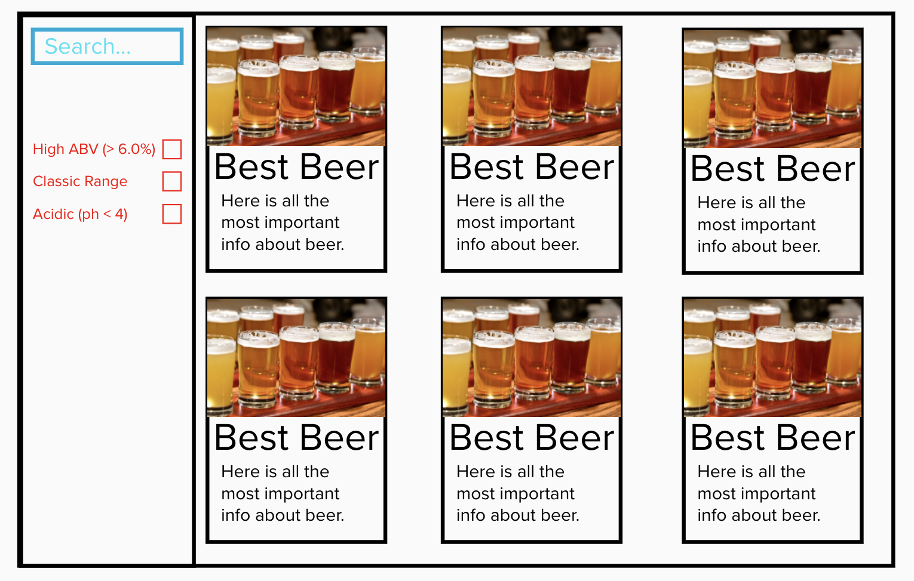
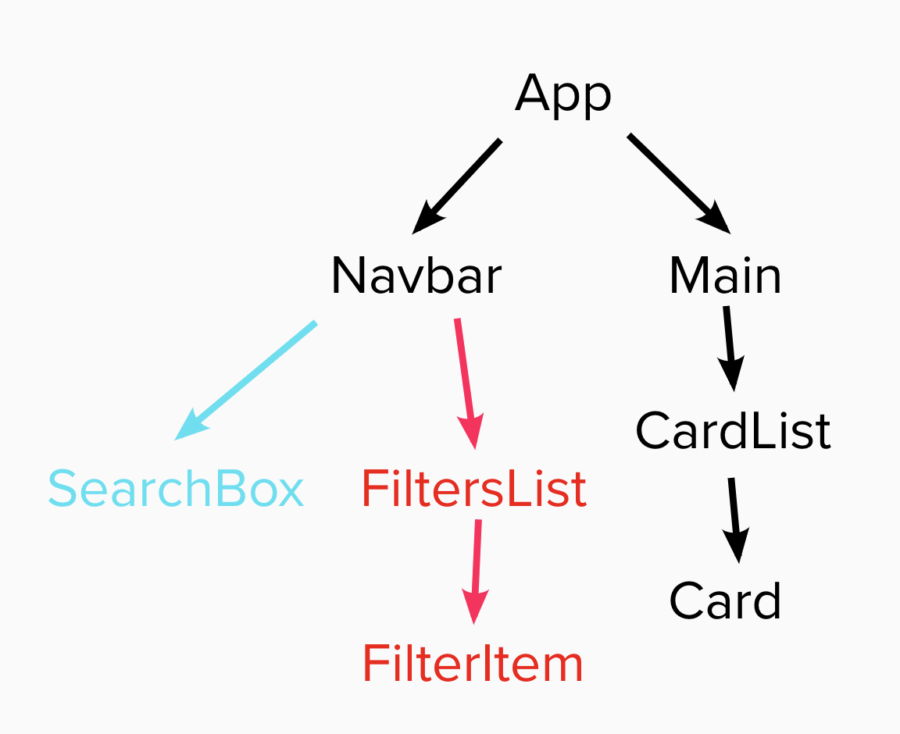

# Punk Api Challenge

Your task is to build a site to the wireframe below: 

There is a file called data/beers.js which contains all the data you will need for the task. Please refer to Mealworm as well as the sandbox apps we built together over the last two days!

## Challenge - Black Borders

All the wireframe content in black is part of the main challenge - that is, the sidenav, the main section containing the beers and beer cards for each piece of data. Here is a component tree to help you get started - you only need the section in black:

## Extension 1 - SearchBox (Blue borders/lines)

Once you've got the design and layout sorted to render the elements, it's time to add some search functionality. Make it so you can search the beers by their name, and **the page content should update as you type each letter in the box**.

## Extension 2 - Filtering (Red borders/lines)

Finally the extra extra (only if you have the time), make it so you can filter the content on three conditions: 

 - High Alcohol (ABV value greater than 6%)
 - Classic Range (Was first brewed before 2010)
 - High Acidity (pH lower than 4)
 - Here is the video demo
 - [Screencast from 01-08-2022  8:20:46 WB.webm](https://user-images.githubusercontent.com/106494517/182215182-c65ebe19-b72a-4d58-9b3b-9c9c48e7677d.webm)

Best of luck!
